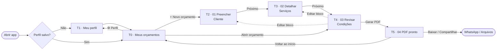

# 3. Prototipação de Interfaces

[← Voltar ao README](../README.md)

Protótipos de **baixa fidelidade (wireframes)** das telas do MVP, desenhados para largura de **360 px** (mobile-first, RNF12). Os wireframes seguem o fluxo de 4 etapas apresentado no pitch: **Preencher → Detalhar → Revisar → Gerar PDF**.

## 3.1 Mapa de navegação



## 3.2 Componentes comuns

| Componente | Descrição |
|---|---|
| **Indicador de etapas** | Barra no topo com as 4 etapas (`● ● ○ ○`), indicando a etapa atual. |
| **Barra de ação fixa** | Rodapé fixo com botão principal largo (altura 56 px) — "Próximo", "Gerar PDF" etc. |
| **Total fixo** | Na etapa 02, o total aparece acima do botão principal, sempre visível (RN02). |
| **Campo monetário** | Máscara BRL em centavos, teclado numérico (RN03, RNF16). |
| **Toast** | Mensagens curtas: "Perfil salvo", "Item removido · Desfazer". |

---

## 3.3 Wireframes

### T0 — Meus orçamentos (tela inicial) · RF12, RF13 · US08

```
┌────────────────────────────────────┐
│ OrçaFácil                     ⚙    │
├────────────────────────────────────┤
│ 🔍 Buscar por cliente...           │
├────────────────────────────────────┤
│ ORC-2026-0003        ● Rascunho    │
│ Carlos Souza                       │
│ 07/10/2026           R$ 1.150,00 ⋮ │
├────────────────────────────────────┤
│ ORC-2026-0002        ✓ Emitido     │
│ Maria Silva                        │
│ 05/10/2026             R$ 800,00 ⋮ │
├────────────────────────────────────┤
│ ORC-2026-0001        ✓ Emitido     │
│ Ana Lima                           │
│ 02/10/2026           R$ 2.400,00 ⋮ │
│                                    │
│   ⋮ = Abrir · Duplicar · Baixar    │
│       PDF · Excluir                │
├────────────────────────────────────┤
│ ┌────────────────────────────────┐ │
│ │      +  NOVO ORÇAMENTO         │ │
│ └────────────────────────────────┘ │
└────────────────────────────────────┘
```

*Estado vazio:* ilustração + "Você ainda não criou orçamentos. Toque em **Novo orçamento** para começar."

### T1 — Meu perfil · RF01 · US01

```
┌────────────────────────────────────┐
│ ←  Meu perfil                      │
├────────────────────────────────────┤
│ Esses dados aparecem em todos os   │
│ seus orçamentos.                   │
│                                    │
│ Seu nome *                         │
│ ┌────────────────────────────────┐ │
│ │ João da Silva                  │ │
│ └────────────────────────────────┘ │
│ Nome da empresa                    │
│ ┌────────────────────────────────┐ │
│ │ João Pinturas                  │ │
│ └────────────────────────────────┘ │
│ Telefone / WhatsApp *              │
│ ┌────────────────────────────────┐ │
│ │ (11) 98765-4321                │ │
│ └────────────────────────────────┘ │
│ E-mail                             │
│ ┌────────────────────────────────┐ │
│ │                                │ │
│ └────────────────────────────────┘ │
│ CPF / CNPJ (opcional)              │
│ ┌────────────────────────────────┐ │
│ │                                │ │
│ └────────────────────────────────┘ │
│ 🔒 Seus dados ficam só neste       │
│    aparelho.                       │
├────────────────────────────────────┤
│ ┌────────────────────────────────┐ │
│ │            SALVAR              │ │
│ └────────────────────────────────┘ │
└────────────────────────────────────┘
```

### T2 — Etapa 01 · Preencher (cliente) · RF02, RF03 · US02

```
┌────────────────────────────────────┐
│ ←  Novo orçamento   ORC-2026-0004  │
│ ●━━━━━━━○━━━━━━━○━━━━━━━○          │
│ Preencher Detalhar Revisar  PDF    │
├────────────────────────────────────┤
│ PROFISSIONAL               Editar  │
│ João Pinturas · (11) 98765-4321    │
├────────────────────────────────────┤
│ CLIENTE                            │
│ Nome do cliente *                  │
│ ┌────────────────────────────────┐ │
│ │ Maria Silva                    │ │
│ └────────────────────────────────┘ │
│ Telefone                           │
│ ┌────────────────────────────────┐ │
│ │                                │ │
│ └────────────────────────────────┘ │
│ Endereço do serviço                │
│ ┌────────────────────────────────┐ │
│ │ Rua das Flores, 100 - Apto 12  │ │
│ └────────────────────────────────┘ │
│                                    │
├────────────────────────────────────┤
│ ┌────────────────────────────────┐ │
│ │           PRÓXIMO  →           │ │
│ └────────────────────────────────┘ │
└────────────────────────────────────┘
```

### T3 — Etapa 02 · Detalhar (serviços) · RF04, RF05, RF06 · US03, US04

```
┌────────────────────────────────────┐
│ ←  Serviços         ORC-2026-0004  │
│ ●━━━━━━━●━━━━━━━○━━━━━━━○          │
├────────────────────────────────────┤
│ Descrição do serviço *             │
│ ┌────────────────────────────────┐ │
│ │ Pintura de parede              │ │
│ └────────────────────────────────┘ │
│ Qtd *       Unid.     Valor unit.* │
│ ┌───────┐ ┌───────┐ ┌────────────┐ │
│ │ 20    │ │ m²  ▾ │ │ R$ 25,00   │ │
│ └───────┘ └───────┘ └────────────┘ │
│ ┌────────────────────────────────┐ │
│ │     +  ADICIONAR ITEM          │ │
│ └────────────────────────────────┘ │
├────────────────────────────────────┤
│ ITENS (2)                          │
│ 1. Pintura de parede          ✎ 🗑 │
│    20 m² × R$ 25,00    R$ 500,00   │
│ 2. Massa corrida              ✎ 🗑 │
│    1 vb × R$ 300,00    R$ 300,00   │
├────────────────────────────────────┤
│ TOTAL                  R$ 800,00   │  ← somente leitura (RN02)
│ ┌────────────────────────────────┐ │
│ │           PRÓXIMO  →           │ │
│ └────────────────────────────────┘ │
└────────────────────────────────────┘
```

### T4 — Etapa 03 · Revisar (condições) · RF07, RF08, RF09 · US05

```
┌────────────────────────────────────┐
│ ←  Revisar          ORC-2026-0004  │
│ ●━━━━━━━●━━━━━━━●━━━━━━━○          │
├────────────────────────────────────┤
│ Prazo de execução *                │
│ ┌──────────┐                       │
│ │ 2        │ dias                  │
│ └──────────┘                       │
│ Condições de pagamento             │
│ ┌────────────────────────────────┐ │
│ │ 50% no início e 50% na         │ │
│ │ conclusão.                     │ │
│ └────────────────────────────────┘ │
│ Validade da proposta  [ 15 ] dias  │
│ Observações                        │
│ ┌────────────────────────────────┐ │
│ │ Materiais por conta do cliente.│ │
│ └────────────────────────────────┘ │
├────────────────────────────────────┤
│ RESUMO                             │
│ Cliente: Maria Silva      Editar   │
│ 2 itens                   Editar   │
│ TOTAL               R$ 800,00      │
├────────────────────────────────────┤
│ ┌────────────────────────────────┐ │
│ │        📄  GERAR PDF           │ │  ← desabilitado se RN01
│ └────────────────────────────────┘ │     não for atendida
└────────────────────────────────────┘
```

### T5 — Etapa 04 · PDF pronto · RF10, RF11 · US06, US07

```
┌────────────────────────────────────┐
│ ←  Orçamento pronto  ✓ Emitido     │
│ ●━━━━━━━●━━━━━━━●━━━━━━━●          │
├────────────────────────────────────┤
│ ┌────────────────────────────────┐ │
│ │ JOÃO PINTURAS                  │ │
│ │ (11) 98765-4321                │ │
│ │ ────────────────────────────── │ │
│ │ ORÇAMENTO  ORC-2026-0004       │ │
│ │ Emissão: 08/10/2026            │ │
│ │ Cliente: Maria Silva           │ │
│ │ ────────────────────────────── │ │
│ │ Serviço      Qtd  Unit.  Total │ │
│ │ Pintura      20m² 25,00 500,00 │ │
│ │ Massa corr.  1vb 300,00 300,00 │ │
│ │ ────────────────────────────── │ │
│ │ TOTAL              R$ 800,00   │ │
│ │ Prazo: 2 dias                  │ │
│ │ Pagamento: 50% início / 50%... │ │
│ │ Válido até 23/10/2026          │ │
│ └────────────────────────────────┘ │
│        (pré-visualização)          │
├────────────────────────────────────┤
│ ┌──────────────┐ ┌───────────────┐ │
│ │  ⬇ BAIXAR    │ │ ↗ COMPARTILHAR│ │
│ └──────────────┘ └───────────────┘ │
│        Voltar aos orçamentos       │
└────────────────────────────────────┘
```

---

## 3.4 Layout do PDF gerado (A4)

```
┌──────────────────────────────────────────────────────────┐
│  JOÃO PINTURAS                          ORÇAMENTO         │
│  João da Silva · CNPJ 00.000.000/0001-00  Nº ORC-2026-0004│
│  (11) 98765-4321 · joao@email.com       Emissão 08/10/2026│
├──────────────────────────────────────────────────────────┤
│  CLIENTE                                                  │
│  Maria Silva · Rua das Flores, 100 - Apto 12              │
├──────────────────────────────────────────────────────────┤
│  #  Descrição              Qtd   Unid.  Valor unit.  Total│
│  1  Pintura de parede      20    m²      R$ 25,00  R$ 500,00
│  2  Massa corrida           1    vb     R$ 300,00  R$ 300,00
├──────────────────────────────────────────────────────────┤
│                                  TOTAL       R$ 800,00    │
├──────────────────────────────────────────────────────────┤
│  Prazo de execução: 2 dias                                │
│  Condições de pagamento: 50% no início e 50% na conclusão.│
│  Observações: Materiais por conta do cliente.             │
│  Proposta válida até 23/10/2026.                          │
├──────────────────────────────────────────────────────────┤
│  ______________________________                           │
│  João da Silva                                            │
│                         Gerado com OrçaFácil · pág. 1/1   │
└──────────────────────────────────────────────────────────┘
```

## 3.5 Diretrizes visuais

| Aspecto | Diretriz |
|---|---|
| Tipografia | Fonte sem serifa (Inter/Roboto), corpo ≥ 16 px na interface |
| Cores | 1 cor primária para ações, neutros para conteúdo; contraste ≥ 4,5:1 (RNF15) |
| Botões | Altura 48–56 px, largura total no rodapé (RNF13) |
| Feedback | Erros abaixo do campo, em vermelho + ícone + texto (não só cor) |
| Linguagem | Simples e direta, sem jargões ("Próximo", "Gerar PDF", "Baixar") |
