# 3. Prototipação de Interfaces

[← Voltar ao README](../README.md)

O protótipo das telas do MVP está no **Figma**, que é a **fonte de verdade** da interface. Layout, textos, cores e estados devem ser implementados como estão lá.

🔗 **Arquivo:** [OrçaFácil — Protótipo MVP](https://www.figma.com/design/49nWhL3pQQirvTCHLlyNTN/OrcaFacil-Prototipo-MVP)

As telas foram desenhadas para **360 px** de largura (mobile-first, RNF12) e seguem o fluxo de 4 etapas apresentado no pitch: **Preencher → Detalhar → Revisar → Gerar PDF**. Este documento traz o mapa de navegação, uma cópia das telas exportadas do Figma (em [`prototipo/`](prototipo/)) e a ligação de cada tela com os requisitos. Se uma imagem daqui divergir do Figma, vale o Figma; exporte de novo a tela para atualizar.

O arquivo tem três páginas:

| Página | Conteúdo |
|---|---|
| 📱 **Protótipo** | 20 telas em 3 seções: *1 · Fluxo principal*, *2 · Estados e erros*, *3 · Perfil, privacidade e variações* |
| 🧩 **Componentes** | Biblioteca de componentes (seção 3.2) |
| 📄 **PDF A4** | Componente `PDF / Orçamento A4` (595 × 842 pt), também usado na pré-visualização da T5 (seção 3.4) |

## 3.1 Mapa de navegação

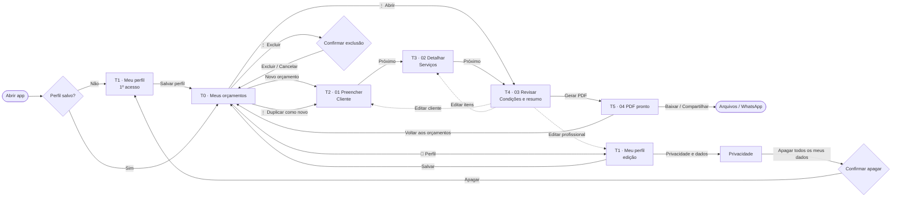

*"⋮" = ação do menu do orçamento. "Baixar PDF" no menu baixa o arquivo sem sair da T0.*

## 3.2 Componentes

Componentes da página 🧩 **Componentes** do Figma e padrões que se repetem nas telas.

| Componente | Descrição |
|---|---|
| **Indicador de etapas** | 4 segmentos no topo com rótulos (Preencher · Detalhar · Revisar · PDF); segmentos concluídos e o atual ficam na cor primária e o rótulo atual em destaque. |
| **Barra de ação fixa** | Rodapé fixo com botão principal largo (altura 56 px) — "Próximo", "Gerar PDF" etc. |
| **Total fixo** | Na etapa 02, o total aparece acima do botão principal, sempre visível (RN02). |
| **Campo monetário** | Máscara BRL em centavos, teclado numérico (RN03, RNF16). |
| **Toast** | Mensagens curtas: "Perfil salvo", "Item removido · Desfazer". |
| **Nota** | Linha com ícone + texto curto para dicas, avisos e erros (ex.: "Rascunho salvo automaticamente neste aparelho."). |
| **Bottom sheet / Diálogo** | Menu de ações do orçamento e confirmações destrutivas sobre fundo escurecido. |
| **Botão** | Variantes Primário, Secundário, Texto, Perigo e Desabilitado. |
| **Campo de texto** | Estados Vazio, Preenchido, Foco e Erro. |
| **Status** | Selos Rascunho e Emitido (RN10). |
| **Barra superior** | Tipo Início (logo + perfil) e tipo Etapa (voltar + título + número do orçamento). |
| **Card de orçamento · Item de serviço · Linha de resumo** | Blocos de lista da T0, T3 e T4. |
| **Ícones** | 21 ícones de traço (arrow, user, search, plus, pencil, trash, check, file-text, download, share, lock, shield, info, calendar etc.). |

---

## 3.3 Telas

As imagens foram exportadas do Figma em 2× (720 px de largura). Clique numa imagem para vê-la em tamanho real.

### 3.3.1 Fluxo principal

<table>
<tr>
<td align="center" width="33%"><a href="prototipo/t1-meu-perfil-primeiro-acesso.png">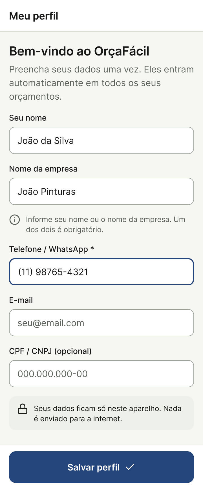</a> <b>T1 · Meu perfil (1º acesso)</b> RF01 · US01 · RN01</td>
<td align="center" width="33%"><a href="prototipo/t0-meus-orcamentos.png">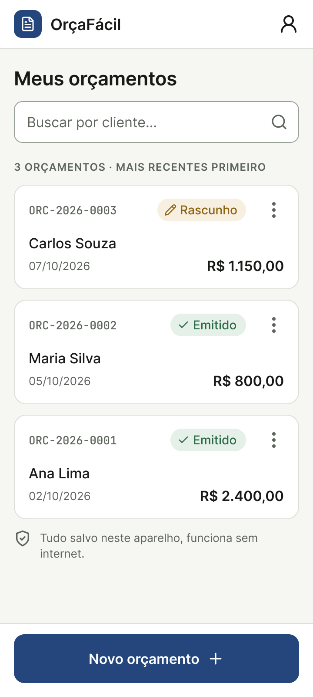</a> <b>T0 · Meus orçamentos</b> RF12 · US08 · RN10</td>
<td align="center" width="33%"><a href="prototipo/t2-01-preencher.png">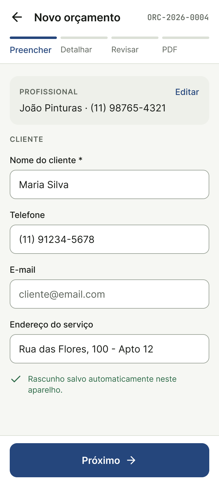</a> <b>T2 · 01 Preencher</b> RF02, RF03, RF13 · US02</td>
</tr>
<tr>
<td align="center"><a href="prototipo/t3-02-detalhar.png">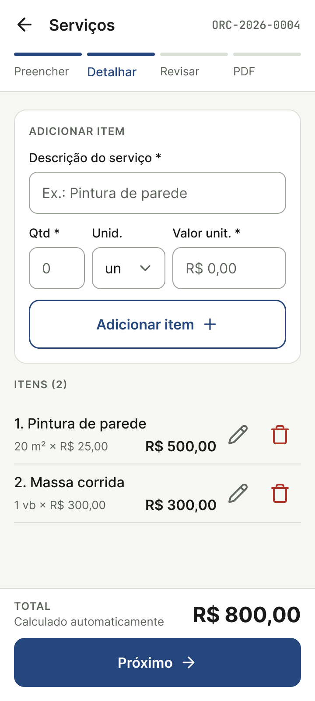</a> <b>T3 · 02 Detalhar</b> RF04–RF06 · US03, US04 · RN02</td>
<td align="center"><a href="prototipo/t4-03-revisar.png">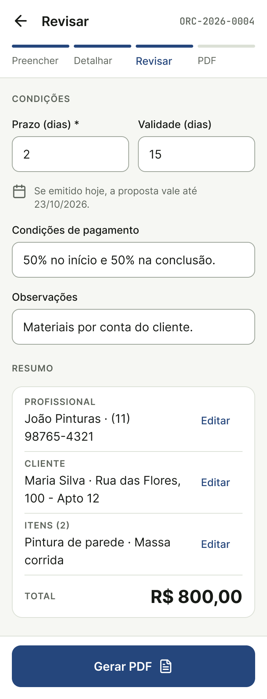</a> <b>T4 · 03 Revisar</b> RF07–RF09 · US05 · RN05, RN06</td>
<td align="center"><a href="prototipo/t5-04-pdf-pronto.png">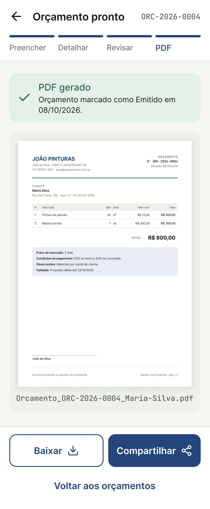</a> <b>T5 · 04 PDF pronto</b> RF10, RF11 · US06, US07 · RN12</td>
</tr>
</table>

### 3.3.2 Estados e erros

<table>
<tr>
<td align="center" width="33%"><a href="prototipo/t0-estado-vazio.png">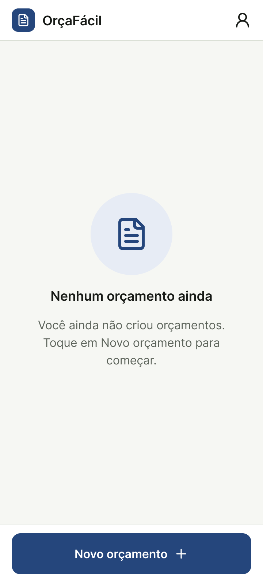</a> <b>T0 · Estado vazio</b> RF12</td>
<td align="center" width="33%"><a href="prototipo/t0-busca.png">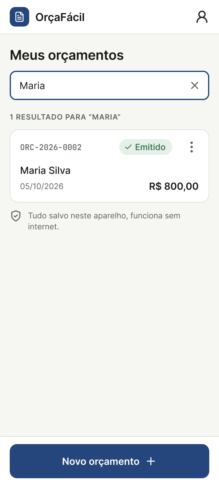</a> <b>T0 · Busca por cliente</b> RF12</td>
<td align="center" width="33%"><a href="prototipo/t0-menu-orcamento.png">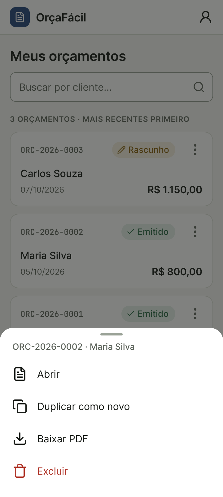</a> <b>T0 · Menu do orçamento</b> Abrir · Duplicar · Baixar PDF · Excluir RF12, RF13</td>
</tr>
<tr>
<td align="center"><a href="prototipo/t0-confirmar-exclusao.png">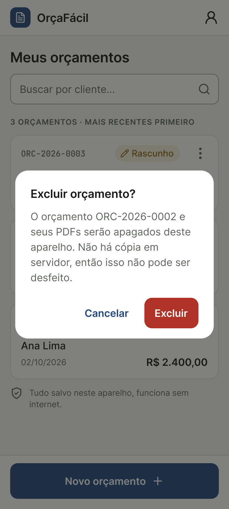</a> <b>T0 · Confirmar exclusão</b> RN14</td>
<td align="center"><a href="prototipo/t2-erros-validacao.png">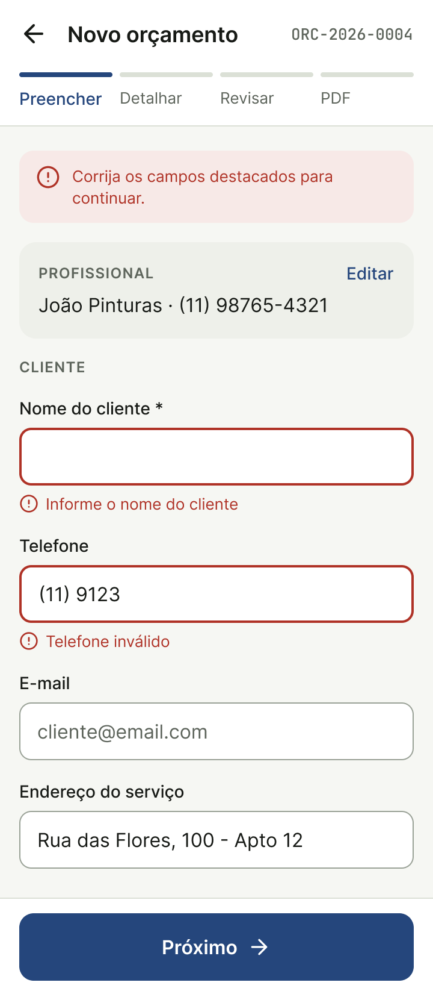</a> <b>T2 · Erros de validação</b> RF02 · RNF15</td>
<td align="center"><a href="prototipo/t3-item-removido-desfazer.png">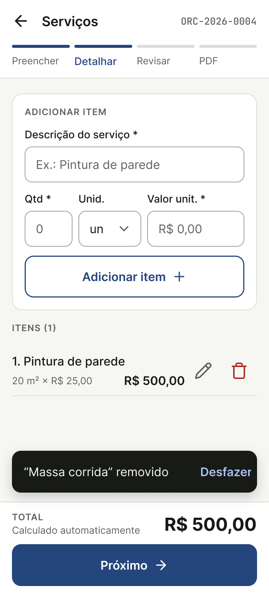</a> <b>T3 · Item removido (Desfazer)</b> RF05 · RN14</td>
</tr>
<tr>
<td align="center"><a href="prototipo/t3-valor-zerado.png">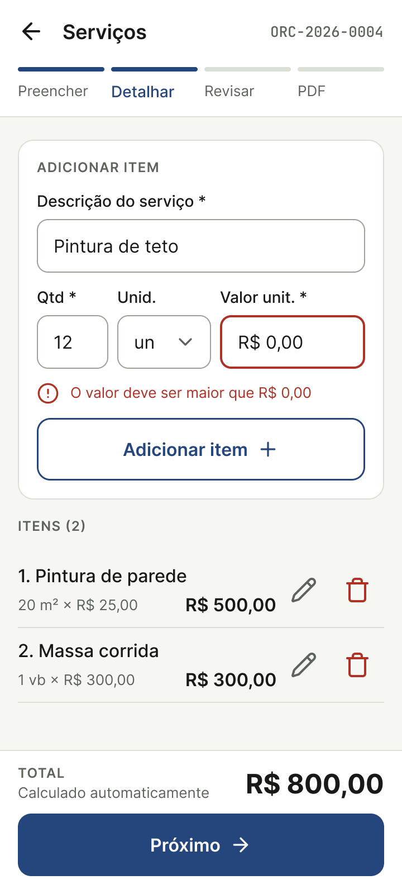</a> <b>T3 · Valor zerado</b> RN04</td>
<td align="center"><a href="prototipo/t4-gerar-pdf-bloqueado.png">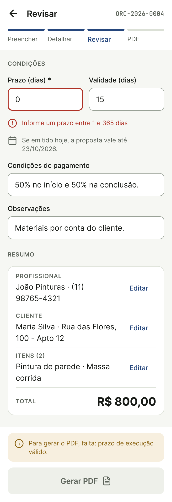</a> <b>T4 · Gerar PDF bloqueado</b> RN01, RN05</td>
<td></td>
</tr>
</table>

### 3.3.3 Perfil, privacidade e variações

<table>
<tr>
<td align="center" width="33%"><a href="prototipo/t1-meu-perfil-edicao.png">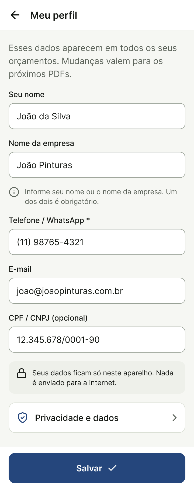</a> <b>T1 · Meu perfil (edição)</b> RF01 · RN11 · RNF21</td>
<td align="center" width="33%"><a href="prototipo/t1-perfil-incompleto.png">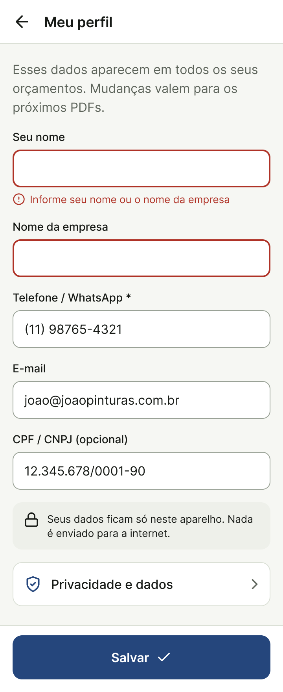</a> <b>T1 · Perfil incompleto</b> RF01 · RN01</td>
<td align="center" width="33%"><a href="prototipo/t0-perfil-salvo.png">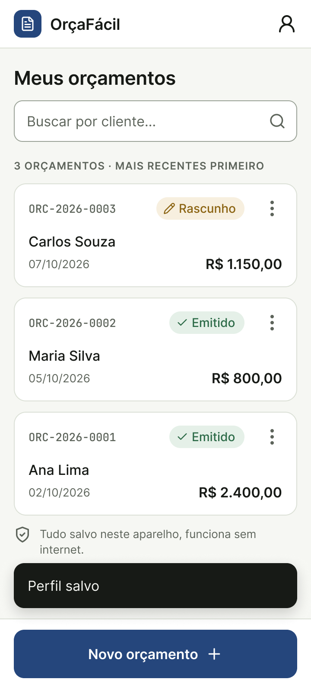</a> <b>T0 · Perfil salvo (toast)</b> RF01</td>
</tr>
<tr>
<td align="center" width="33%"><a href="prototipo/privacidade.png">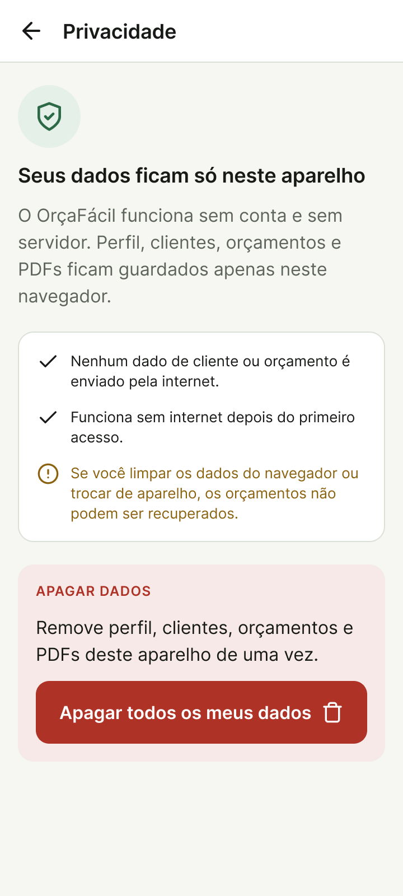</a> <b>Privacidade</b> RNF18 · RNF21</td>
<td align="center" width="33%"><a href="prototipo/privacidade-confirmar-apagar.png">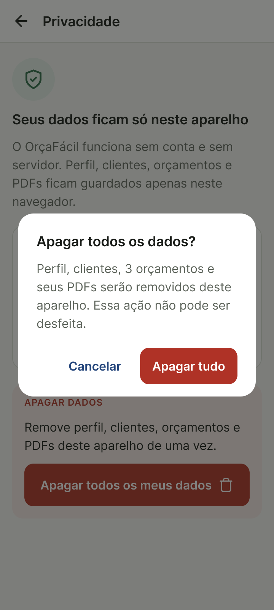</a> <b>Privacidade · Confirmar apagar</b> RNF21</td>
<td align="center" width="33%"><a href="prototipo/t5-sem-compartilhar.png">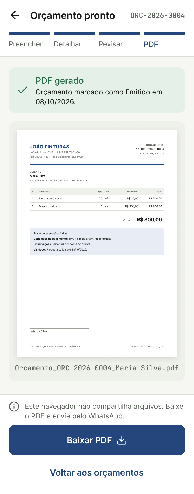</a> <b>T5 · Sem suporte a compartilhar</b> RF11 (sem Web Share: só Baixar)</td>
</tr>
</table>

---

## 3.4 PDF gerado (A4)

<table>
<tr>
<td width="45%"><a href="prototipo/pdf-a4.png">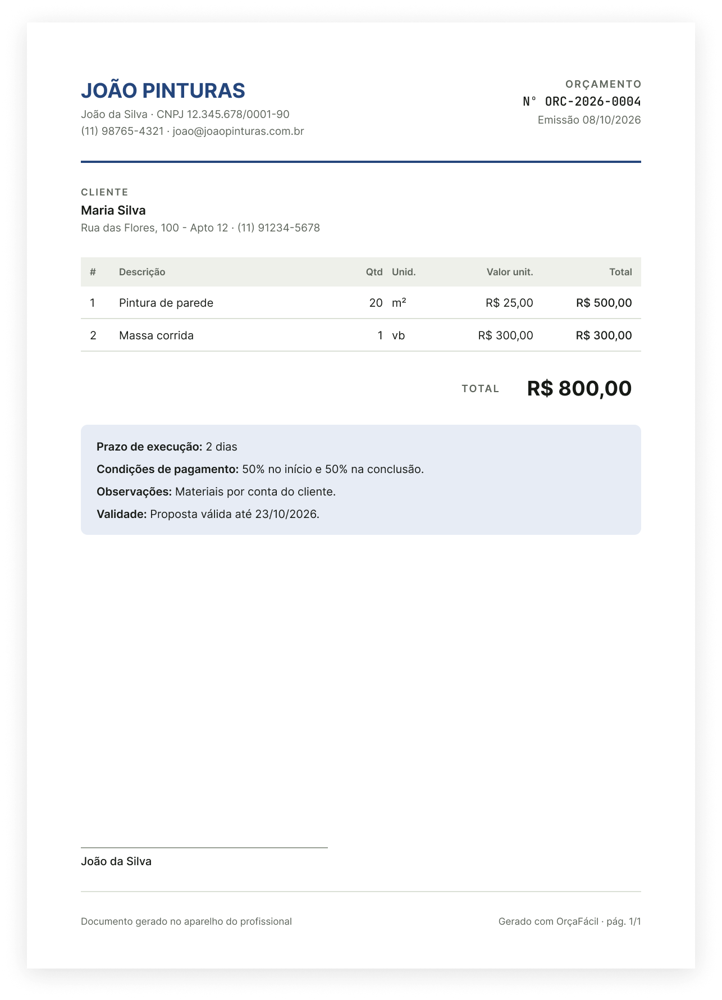</a></td>
<td valign="top">

Componente [PDF / Orçamento A4](https://www.figma.com/design/49nWhL3pQQirvTCHLlyNTN/OrcaFacil-Prototipo-MVP?node-id=4-2) (exportado do Figma em 2×; o mesmo componente aparece na pré-visualização da T5). De cima para baixo:

1. **Cabeçalho do profissional**: empresa em destaque, nome, CPF/CNPJ, telefone e e-mail; à direita, número `ORC-AAAA-NNNN` e data de emissão (RN07, RN13).
2. **Cliente**: nome, endereço e telefone.
3. **Tabela de itens**: #, descrição, quantidade, unidade, valor unitário e total por linha.
4. **Total** em destaque (RN02, RN03).
5. **Condições**: prazo de execução, condições de pagamento, observações e data de validade (RN05, RN06).
6. **Assinatura** do profissional.
7. **Rodapé**: "Documento gerado no aparelho do profissional" e "Gerado com OrçaFácil · pág. X/Y".

Requisito: RF10. Nome do arquivo: RN12.

</td>
</tr>
</table>

## 3.5 Diretrizes visuais

| Aspecto | Diretriz |
|---|---|
| Tipografia | Fonte sem serifa (Inter no protótipo), corpo ≥ 16 px na interface; número do orçamento e nome do arquivo em fonte monoespaçada |
| Cores | 1 cor primária para ações, neutros para conteúdo; contraste ≥ 4,5:1 (RNF15). No protótipo: primária azul-marinho `#25467C`, fundo `#F6F7F3`, superfícies brancas, perigo `#AF3226`, fundo de sucesso/Emitido `#E5F0E8`, fundo de Rascunho `#F7EFDF` (valores aproximados, medidos nas imagens exportadas) |
| Botões | Altura 48–56 px, largura total no rodapé (RNF13) |
| Feedback | Erros abaixo do campo, em vermelho + ícone + texto (não só cor) |
| Linguagem | Simples e direta, sem jargões ("Próximo", "Gerar PDF", "Baixar") |
