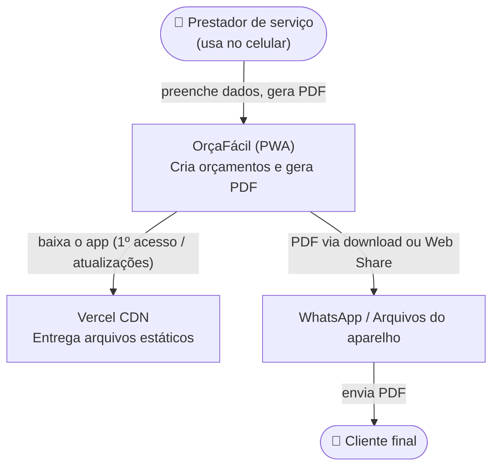
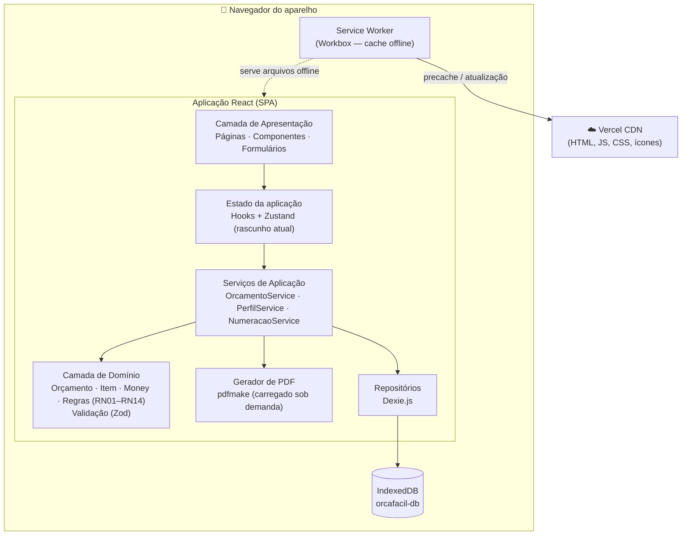
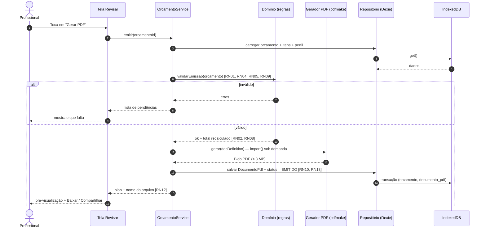

# 4. Arquitetura de Software

[← Voltar ao README](../README.md) · [ADRs](adr/README.md)

## 4.1 Visão geral

O OrçaFácil é uma **Progressive Web App (PWA) local-first**: todo o processamento (validação, cálculo, persistência e geração do PDF) acontece **no navegador do aparelho**. O servidor apenas entrega arquivos estáticos (HTML, JS, CSS, ícones) via CDN. Depois do primeiro acesso, o Service Worker mantém o app em cache e ele funciona sem internet.

Decisões que fundamentam essa arquitetura: [ADR-001](adr/ADR-001-arquitetura-local-first-pwa.md) (local-first), [ADR-002](adr/ADR-002-frontend-react-typescript-vite.md) (frontend), [ADR-003](adr/ADR-003-banco-de-dados-indexeddb-dexie.md) (banco), [ADR-004](adr/ADR-004-geracao-pdf-pdfmake.md) (PDF), [ADR-005](adr/ADR-005-hospedagem-vercel.md) (hospedagem).

## 4.2 Diagrama de contexto (C4 — nível 1)



## 4.3 Diagrama de contêineres e componentes (C4 — níveis 2/3)



### Responsabilidades por camada

| Camada | Responsabilidade | Regra de dependência |
|---|---|---|
| **Apresentação** (`src/ui`) | Telas, componentes, máscaras de entrada, feedback visual. | Depende de Estado e Serviços. Não acessa o banco diretamente. |
| **Estado** (`src/state`) | Rascunho em edição, etapa atual, autosave com *debounce*. | Depende de Serviços. |
| **Serviços** (`src/services`) | Casos de uso: criar orçamento, adicionar item, emitir, duplicar, excluir. | Orquestra Domínio, Repositórios e PDF. |
| **Domínio** (`src/domain`) | Entidades, value object `Money` (centavos), cálculo do total, validações e regras de negócio. **Código puro**, sem dependência de React ou do banco. | Não depende de nenhuma outra camada. |
| **Infraestrutura** (`src/infra`) | Repositórios Dexie, gerador pdfmake, Web Share/download. | Implementa interfaces definidas no Domínio/Serviços. |

## 4.4 Fluxo principal — Gerar PDF (sequência)



## 4.5 Estrutura de pastas proposta

```
src/
├── domain/            # Regras puras (100% testáveis)
│   ├── money.ts       # Money em centavos, formatação BRL
│   ├── orcamento.ts   # Entidade, cálculo de total, ciclo de vida
│   ├── item.ts
│   └── schemas.ts     # Schemas Zod (RN01, RN04, RN05, RN06)
├── services/          # Casos de uso
├── infra/
│   ├── db/            # Dexie: schema, migrações, repositórios
│   ├── pdf/           # docDefinition do pdfmake
│   └── share/         # Download e Web Share API
├── state/             # Store do rascunho + autosave
├── ui/
│   ├── pages/         # T0..T5 (ver prototipação)
│   └── components/
└── main.tsx
```

## 4.6 Estratégia de qualidade

| Nível | Ferramenta | Foco |
|---|---|---|
| Unitário | Vitest | Domínio: `Money`, cálculo, arredondamento, validações, numeração |
| Componente | Testing Library | Formulários, máscaras, habilitação do botão "Gerar PDF" |
| E2E | Playwright (Chromium, WebKit, Firefox) | Fluxo completo, offline, tempo de geração do PDF, persistência |
| Desempenho | Lighthouse CI, size-limit | RNF03, RNF04, RNF05, RNF15, RNF24 |
| CI/CD | GitHub Actions + Vercel | Lint, `tsc`, testes, build; preview por PR e deploy na `main` |
