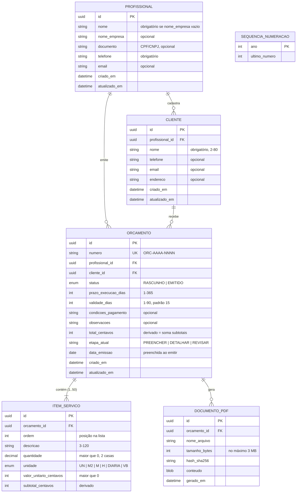

# 5. Modelagem de Dados (DER)

[← Voltar ao README](../README.md) · Decisão relacionada: [ADR-003 — IndexedDB com Dexie.js](adr/ADR-003-banco-de-dados-indexeddb-dexie.md)

O modelo abaixo é **relacional no nível lógico**. Fisicamente ele é implementado em **IndexedDB** (uma *object store* por entidade), e a integridade referencial é garantida pela camada de Repositórios da aplicação. Uma versão em SQL (DDL) é fornecida na seção 5.5 para documentação e para uma eventual migração a um banco relacional.

## 5.1 Diagrama Entidade-Relacionamento



> `SEQUENCIA_NUMERACAO` é uma tabela de controle (sem relacionamentos) que garante a numeração única e não reutilizável dos orçamentos (RN07).

## 5.2 Relacionamentos e cardinalidades

| Relacionamento | Cardinalidade | Descrição | Regra na exclusão |
|---|---|---|---|
| PROFISSIONAL → CLIENTE | 1 : 0..N | Um profissional cadastra vários clientes. | Exclusão do perfil (apagar dados — RNF21) remove tudo. |
| PROFISSIONAL → ORCAMENTO | 1 : 0..N | Um profissional emite vários orçamentos. | Idem. |
| CLIENTE → ORCAMENTO | 1 : 0..N | Um cliente pode receber vários orçamentos; cada orçamento pertence a exatamente 1 cliente. | **Restrita**: cliente com orçamentos não pode ser excluído. |
| ORCAMENTO → ITEM_SERVICO | 1 : 1..50 | Composição: itens não existem fora do orçamento (RN09). Um rascunho pode ter 0 itens temporariamente; para emitir, ≥ 1. | **Cascata**. |
| ORCAMENTO → DOCUMENTO_PDF | 1 : 0..N | Cada emissão gera um PDF; o mais recente é o vigente (RN10). | **Cascata**. |

> No MVP existe **um único perfil** por aparelho, mas o modelo mantém `profissional_id` para permitir múltiplos perfis/empresas e sincronização em nuvem no futuro sem reestruturar os dados.

## 5.3 Dicionário de dados

### PROFISSIONAL — perfil de quem emite o orçamento (RF01)

| Atributo | Tipo | Nulo | Restrições / Observações |
|---|---|---|---|
| id | UUID v4 | Não | PK |
| nome | texto (80) | Sim* | *Obrigatório se `nome_empresa` for nulo (RN01) |
| nome_empresa | texto (80) | Sim | Exibido em destaque no cabeçalho do PDF quando informado |
| documento | texto (18) | Sim | CPF (11 dígitos) ou CNPJ (14 dígitos), validado por dígito verificador; armazenado só com números |
| telefone | texto (11) | Não | 10–11 dígitos (DDD + número), armazenado só com números |
| email | texto (120) | Sim | Formato de e-mail válido |
| criado_em / atualizado_em | data-hora ISO 8601 | Não | Preenchidos automaticamente |

### CLIENTE — destinatário do orçamento (RF02)

| Atributo | Tipo | Nulo | Restrições / Observações |
|---|---|---|---|
| id | UUID v4 | Não | PK |
| profissional_id | UUID | Não | FK → PROFISSIONAL.id |
| nome | texto (80) | Não | 2–80 caracteres; indexado para busca (CA08.2) |
| telefone | texto (11) | Sim | 10–11 dígitos |
| email | texto (120) | Sim | |
| endereco | texto (200) | Sim | Endereço onde o serviço será realizado |
| criado_em / atualizado_em | data-hora | Não | |

### ORCAMENTO — proposta comercial (RF03, RF06–RF09)

| Atributo | Tipo | Nulo | Restrições / Observações |
|---|---|---|---|
| id | UUID v4 | Não | PK |
| numero | texto (13) | Não | **Único**; formato `ORC-AAAA-NNNN` (RN07) |
| profissional_id | UUID | Não | FK → PROFISSIONAL.id |
| cliente_id | UUID | Não | FK → CLIENTE.id |
| status | enum | Não | `RASCUNHO` (padrão) ou `EMITIDO` (RN10) |
| prazo_execucao_dias | inteiro | Sim* | 1–365; *obrigatório para emitir (RN05) |
| validade_dias | inteiro | Não | 1–90; padrão 15 (RN06) |
| condicoes_pagamento | texto (500) | Sim | Ex.: "50% no início e 50% na conclusão" |
| observacoes | texto (1000) | Sim | Ex.: "Materiais por conta do cliente" |
| total_centavos | inteiro | Não | **Derivado** = Σ `ITEM_SERVICO.subtotal_centavos`; nunca editado pelo usuário (RN02). Persistido para listagem rápida. |
| etapa_atual | enum | Não | Etapa onde o usuário parou (CA08.3) |
| data_emissao | data | Sim | Preenchida automaticamente ao emitir (RN13) |
| criado_em / atualizado_em | data-hora | Não | `atualizado_em` indexado (ordenação da lista) |

### ITEM_SERVICO — linha do orçamento (RF04, RF05)

| Atributo | Tipo | Nulo | Restrições / Observações |
|---|---|---|---|
| id | UUID v4 | Não | PK |
| orcamento_id | UUID | Não | FK → ORCAMENTO.id (cascata) |
| ordem | inteiro | Não | 1..50, define a ordem na lista e no PDF |
| descricao | texto (120) | Não | 3–120 caracteres (RN04) |
| quantidade | decimal(7,2) | Não | > 0 e ≤ 99.999,99 (RN04) |
| unidade | enum | Não | `UN`, `M2`, `M`, `H`, `DIARIA`, `VB` (verba) |
| valor_unitario_centavos | inteiro | Não | > 0 e ≤ 999.999.999 (RN04, RN08) |
| subtotal_centavos | inteiro | Não | **Derivado** = arredondar(quantidade × valor_unitario_centavos) (RN08) |

### DOCUMENTO_PDF — arquivo gerado (RF10, RF11)

| Atributo | Tipo | Nulo | Restrições / Observações |
|---|---|---|---|
| id | UUID v4 | Não | PK |
| orcamento_id | UUID | Não | FK → ORCAMENTO.id (cascata); indexado |
| nome_arquivo | texto (80) | Não | `Orcamento_<numero>_<cliente>.pdf` (RN12) |
| tamanho_bytes | inteiro | Não | ≤ 3.145.728 (3 MB — RNF06) |
| hash_sha256 | texto (64) | Não | Integridade do arquivo |
| conteudo | Blob | Não | `application/pdf` — é o *snapshot* imutável do orçamento na emissão (RN11) |
| gerado_em | data-hora | Não | Indexado; o mais recente é o PDF vigente |

### SEQUENCIA_NUMERACAO — controle de numeração (RN07)

| Atributo | Tipo | Nulo | Restrições / Observações |
|---|---|---|---|
| ano | inteiro | Não | PK (ex.: 2026) |
| ultimo_numero | inteiro | Não | Incrementado em transação ao criar orçamento; nunca decrementado |

## 5.4 Implementação física — esquema Dexie.js (IndexedDB)

```ts
// src/infra/db/database.ts
import Dexie, { type Table } from 'dexie';
import type {
  Profissional, Cliente, Orcamento, ItemServico, DocumentoPdf, SequenciaNumeracao,
} from '@/domain';

export class OrcaFacilDB extends Dexie {
  profissionais!: Table<Profissional, string>;
  clientes!: Table<Cliente, string>;
  orcamentos!: Table<Orcamento, string>;
  itensServico!: Table<ItemServico, string>;
  documentosPdf!: Table<DocumentoPdf, string>;
  sequencias!: Table<SequenciaNumeracao, number>;

  constructor() {
    super('orcafacil-db');
    // Sintaxe Dexie: 1º campo = PK; '&' = índice único; '[a+b]' = índice composto
    this.version(1).stores({
      profissionais: 'id',
      clientes:      'id, profissionalId, nome',
      orcamentos:    'id, &numero, profissionalId, clienteId, status, atualizadoEm',
      itensServico:  'id, orcamentoId, [orcamentoId+ordem]',
      documentosPdf: 'id, orcamentoId, geradoEm',
      sequencias:    'ano',
    });
  }
}

export const db = new OrcaFacilDB();
```

Exemplo de operação atômica — **emitir orçamento** (RN10, RN13):

```ts
await db.transaction('rw', db.orcamentos, db.documentosPdf, async () => {
  await db.documentosPdf.add(documento);
  await db.orcamentos.update(orcamento.id, {
    status: 'EMITIDO',
    dataEmissao: hoje,
    atualizadoEm: agora,
  });
});
```

## 5.5 Equivalente relacional (DDL SQL — referência)

```sql
CREATE TABLE profissional (
  id             UUID PRIMARY KEY,
  nome           VARCHAR(80),
  nome_empresa   VARCHAR(80),
  documento      VARCHAR(14),
  telefone       VARCHAR(11)  NOT NULL,
  email          VARCHAR(120),
  criado_em      TIMESTAMP    NOT NULL,
  atualizado_em  TIMESTAMP    NOT NULL,
  CHECK (nome IS NOT NULL OR nome_empresa IS NOT NULL)
);

CREATE TABLE cliente (
  id               UUID PRIMARY KEY,
  profissional_id  UUID         NOT NULL REFERENCES profissional(id) ON DELETE CASCADE,
  nome             VARCHAR(80)  NOT NULL CHECK (char_length(nome) >= 2),
  telefone         VARCHAR(11),
  email            VARCHAR(120),
  endereco         VARCHAR(200),
  criado_em        TIMESTAMP    NOT NULL,
  atualizado_em    TIMESTAMP    NOT NULL
);
CREATE INDEX idx_cliente_nome ON cliente(nome);

CREATE TABLE orcamento (
  id                   UUID PRIMARY KEY,
  numero               VARCHAR(13)  NOT NULL UNIQUE,
  profissional_id      UUID         NOT NULL REFERENCES profissional(id) ON DELETE CASCADE,
  cliente_id           UUID         NOT NULL REFERENCES cliente(id) ON DELETE RESTRICT,
  status               VARCHAR(10)  NOT NULL DEFAULT 'RASCUNHO'
                                    CHECK (status IN ('RASCUNHO','EMITIDO')),
  prazo_execucao_dias  INTEGER      CHECK (prazo_execucao_dias BETWEEN 1 AND 365),
  validade_dias        INTEGER      NOT NULL DEFAULT 15 CHECK (validade_dias BETWEEN 1 AND 90),
  condicoes_pagamento  VARCHAR(500),
  observacoes          VARCHAR(1000),
  total_centavos       BIGINT       NOT NULL DEFAULT 0 CHECK (total_centavos >= 0),
  etapa_atual          VARCHAR(10)  NOT NULL DEFAULT 'PREENCHER',
  data_emissao         DATE,
  criado_em            TIMESTAMP    NOT NULL,
  atualizado_em        TIMESTAMP    NOT NULL,
  CHECK (status = 'RASCUNHO' OR (data_emissao IS NOT NULL AND prazo_execucao_dias IS NOT NULL))
);
CREATE INDEX idx_orcamento_atualizado ON orcamento(atualizado_em DESC);

CREATE TABLE item_servico (
  id                       UUID PRIMARY KEY,
  orcamento_id             UUID          NOT NULL REFERENCES orcamento(id) ON DELETE CASCADE,
  ordem                    SMALLINT      NOT NULL CHECK (ordem BETWEEN 1 AND 50),
  descricao                VARCHAR(120)  NOT NULL CHECK (char_length(descricao) >= 3),
  quantidade               NUMERIC(7,2)  NOT NULL CHECK (quantidade > 0),
  unidade                  VARCHAR(6)    NOT NULL
                                         CHECK (unidade IN ('UN','M2','M','H','DIARIA','VB')),
  valor_unitario_centavos  BIGINT        NOT NULL CHECK (valor_unitario_centavos > 0),
  subtotal_centavos        BIGINT        NOT NULL CHECK (subtotal_centavos > 0),
  UNIQUE (orcamento_id, ordem)
);

CREATE TABLE documento_pdf (
  id             UUID PRIMARY KEY,
  orcamento_id   UUID         NOT NULL REFERENCES orcamento(id) ON DELETE CASCADE,
  nome_arquivo   VARCHAR(80)  NOT NULL,
  tamanho_bytes  INTEGER      NOT NULL CHECK (tamanho_bytes <= 3145728),
  hash_sha256    CHAR(64)     NOT NULL,
  conteudo       BYTEA        NOT NULL,
  gerado_em      TIMESTAMP    NOT NULL
);
CREATE INDEX idx_documento_orcamento ON documento_pdf(orcamento_id, gerado_em DESC);

CREATE TABLE sequencia_numeracao (
  ano            SMALLINT PRIMARY KEY,
  ultimo_numero  INTEGER  NOT NULL DEFAULT 0
);
```

## 5.6 Decisões de modelagem

| Decisão | Justificativa |
|---|---|
| Valores monetários em **centavos inteiros** | Evita erros de ponto flutuante (ex.: `0.1 + 0.2 ≠ 0.3`) — RN08, RNF11. |
| `total_centavos` e `subtotal_centavos` **persistidos** apesar de derivados | Permite listar orçamentos sem carregar itens; recalculados pelo Domínio a cada alteração, nunca editados manualmente (RN02). |
| **UUID** como chave primária | Gerado no aparelho sem servidor; evita colisões em uma futura sincronização em nuvem. |
| PDF armazenado como **snapshot** (`DOCUMENTO_PDF.conteudo`) | Garante que o documento enviado ao cliente não muda se o perfil ou o cliente forem editados depois (RN11). |
| Tabela `SEQUENCIA_NUMERACAO` separada | Garante números não reutilizados mesmo após exclusões (RN07). |
| `CLIENTE` como entidade própria (e não texto dentro do orçamento) | Permite reaproveitar o cliente em novos orçamentos e buscar por cliente (RF12). |
